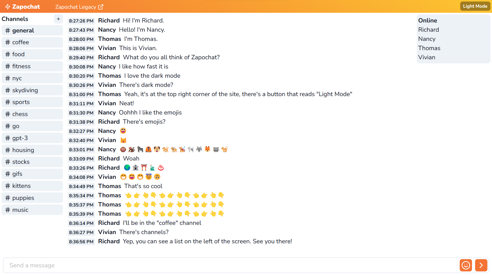
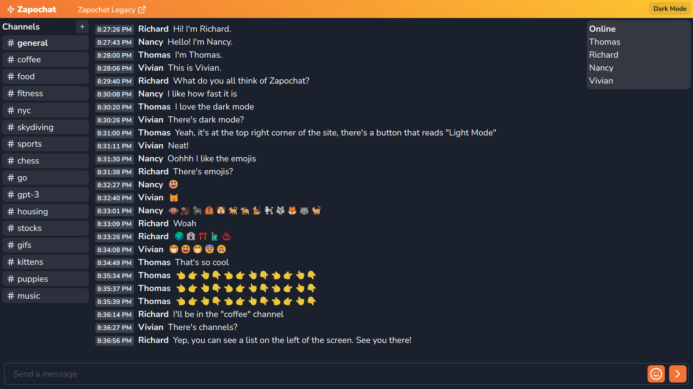

# Zapochat Frontend

Frontend for Zapochat, a browser-based instant messaging application.

Zapochat was originally created with Flask and jQuery. You can find the old repo here: [https://github.com/jimsu2012/zapochat-old](https://github.com/jimsu2012/zapochat-old). The application is accessible via the "Zapochat Legacy" link in the header of this site.

The new Zapochat is split into frontend and backend repositories. This makes them independently deployable. The frontend is deployed on Vercel while the backend is deployed on Heroku. Find the backend at [https://github.com/jimsu2012/zapochat-backend](https://github.com/jimsu2012/zapochat-backend).

The frontend is built with React and written in TypeScript (server-side rendered w/ Next.js, although it's a single page app). The backend is also written in TypeScript and runs the socket.io server.

## Screenshots

Light Mode
\
\

Dark Mode
